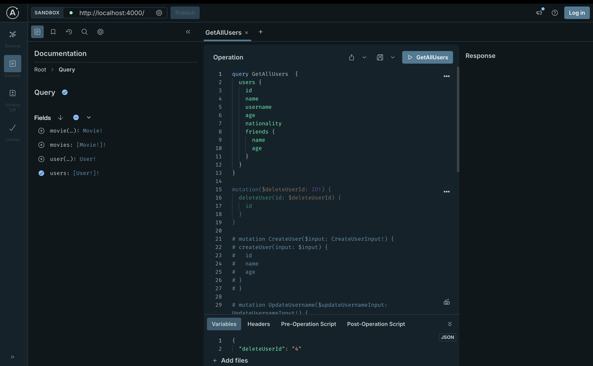

# GraphQL User Manager – Fullstack Learning Project

This is a simple full-stack application built to practice **GraphQL** with a focus on learning and hands-on experimentation. It includes basic **CRUD operations** on users via a React frontend and a Node.js GraphQL backend.

## 📂 Project Structure

- client/ → React frontend using Apollo Client & GraphQL mutations
- server/ → Node.js backend with GraphQL API and resolvers

## 🚀 Getting Started

### 🔧 Prerequisites

- Node.js ≥ v16
- npm
- FakeDB created for testing

### ⚙️ Install Dependencies

From the project root:

```bash
# Install frontend dependencies
cd client && npm install

# Install backend dependencies
cd ../server && npm install
```

## ▶️ Run the App

### Start backend

cd server && npm start

## Start frontend

cd client && npm run dev

##🛠️ Tech Stack
Frontend:
React

Apollo Client

GraphQL

## Backend:

Node.js

Express.js

GraphQL (Apollo Server)

MongoDB (or mock/in-memory)

## ✨ Features

- Create, read, update, and delete users

- GraphQL schema with user type, queries & mutations

- Frontend integration using Apollo Client

- Simple UI for testing functionality

## 🧪 Learning Goals

Practice full GraphQL flow (queries + mutations)

Connect frontend to backend via Apollo

Understand schema design, resolvers, and input types

Improve collaboration between frontend and backend logic

## 📌 Notes

The frontend is minimal, focused on learning rather than styling.

More features (auth, pagination, error handling) may be added as learning progresses.


